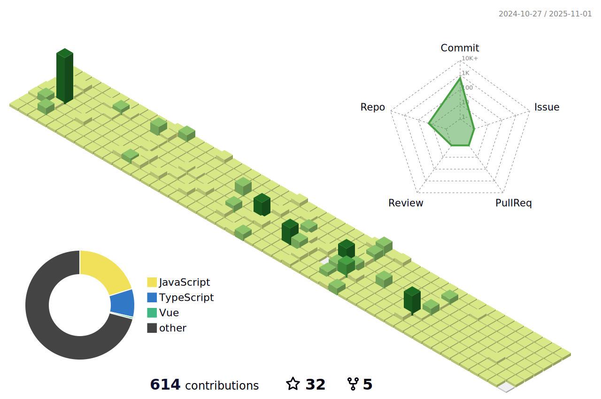

### Hello there, I'm EricYangXD 👋👋👋

<pre>
好好学习，努力搞钱，早日财务自由~~~

啥也不是，有发财机会请带我~~ 谢谢！
</pre>

<!--  -->

<h3 align="left">Languages and Tools:</h3>

			<!--  -->
			
			
			
			
			
			
			<!--  -->
			
			
			
			
			
			
			
			
			
			
			
			
			
			
			
			
		

    

  
  

